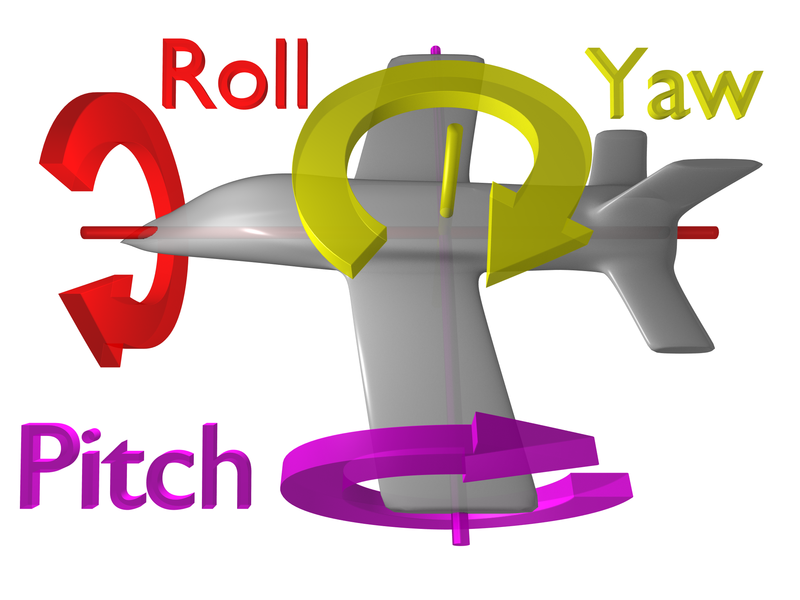
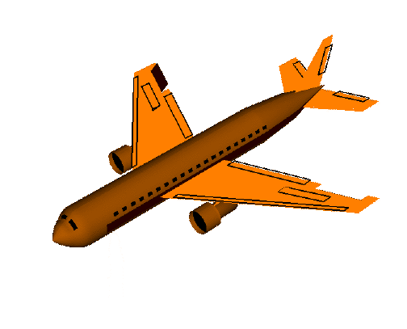

#  三維中pitch，yaw，roll的區別

玩過航模，飛控的童鞋肯定需要知道 yaw, pitch and roll 的區別。這裡給大家分享一下，準備要做飛控的，或者想玩三軸加速度的，或者玩了很久加速度還沒研究過哪個是哪個的，可以看一下。

pitch()：俯仰，將物體繞X軸旋轉（localRotationX）

yaw()：航向，將物體繞Y軸旋轉（localRotationY）

roll()：橫滾，將物體繞Z軸旋轉（localRotationZ）

