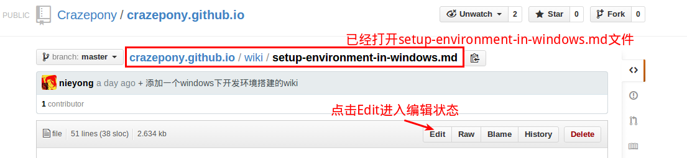

#  如何參與站點建設


## Crazepony站點
Crazepony網站包括了[Crazepony主站](http://crazepony.github.io/index-cn.html)，[Crazepony Wiki](http://crazepony.github.io/wiki.html)百科站點，[Crazepony Blog](http://crazepony.github.io/blog.html)博客站點。

Crazepony網站建設和部署使用了多種開源的技術和平臺。

* 站點部署在github上，使用了github page網站服務器功能，並且整個站點框架使用[jekyll](http://jekyllrb.com/)，這是github page支持的靜態網站框架。
* 前端框架使用[bootstrap](https://github.com/twbs/bootstrap)開源項目
* 百科站點和博客站點內容全部使用markdown標誌語言編輯。

markdown文本解析庫使用了[kramdown](http://kramdown.gettalong.org/)，該庫支持的語法是markdown的一個超集，和標準markdown語法有最小的區別。[quick reference](http://kramdown.gettalong.org/quickref.html)提供了kramdown的快速入門，也可以從[syntax page](http://kramdown.gettalong.org/syntax.html)看到對kramdown支持的markdown語法一個更加詳細的說明。kramdown和markdown最大的一個語法不同點，就是對代碼段的註釋不一樣，導致原來很多地方需要修改。

> markdown的code段註釋為```，而kramdown的code段註釋為~~~

## Crazepony站點源碼結構
Crazepony站點源代碼託管在github上，點擊[這裡](https://github.com/Crazepony/crazepony.github.io)。由於本站點使用了jekyll框架，所以其結構基本上符合jekyll框架結構。

~~~~
├── assets              |網頁相關的資源文件夾，例如圖片，定製css，javascript文件等
├── dist                | bootstrap相關文件，包括css，字體，javascript
├── _layouts            | 網頁模板文件，用於定義網頁的header，footer等
├── wiki                | 存放wiki源文件，markdown格式
├── _posts              | 存放博客源文件，markdown格式
├── blog.html           | 博客首頁
├── _config.yml         | jekyll配置文件
├── index-cn.html       | 站點首頁（中文）
├── index.html          | 站點首頁（英文）
├── README.md           | 本文件
└── wiki.html           | wiki首頁
~~~~

修改最多的就是wiki目錄和posts目錄下的源文件，並且都為markdown格式。在文件最開始加入了一個特定格式的頭，用於jekyll生成靜態網頁。

## 直接在網頁上修改
參與網站wiki，blog等的建設其實很簡單。對於不熟悉git/github，或者不能夠本地修改的夥伴，你也可以直接到網頁上進行修改。下面以修改wiki中的setup-environment-in-windows頁面為例：

* 找到該網頁對應的markdown文件，如上節中所屬，wiki源文件都存放在wiki文件夾。

* 點擊打開該文件，並且點擊右側的Edit按鈕。這時候你可以編輯修改該文件，還可以點擊Preview按鈕預覽修改效果。

* 修改結束之後，請務必協商修改的記錄，然後點擊Save按鈕保存該文件。這個時候到網站上刷新該頁面，則你的修改應該已經生效。


## 將源碼下載到本地
可以將該網站源碼clone到本地，進行修改調試。

~~~
//將github上的源代碼clone到本地
$git clone git@github.com:Crazepony/crazepony.github.io.git

//添加修改並且上傳github
$ git add .
$ git commit -m 'xxxx'
$ git pull --rebase
$ git push

~~~

## 添加新的博客

博客的源文件位於目錄_posts下，並且使用markdown語法編寫。添加一個新的博客只需要在該目錄下添加一個新的markdown文件就可以，但是該文件的命名需要遵守下面的規則：

> 文件名必須以年-月-日開始，例如`2014-03-05-xxxx.md`。

jekyll需要根據這個文件名確定生成的靜態頁面的位置。和wiki不同的是並不需要在根目錄下的blog.html文件中添加新增加的博客列表。


## 參考資料
markdown語法說明：

* [快速入門](http://wowubuntu.com/markdown/basic.html)
* [Markdown Basics](https://help.github.com/articles/markdown-basics)
* [GitHub Flavored Markdown](https://help.github.com/articles/github-flavored-markdown)
* [kramdown語法快速入門](http://kramdown.gettalong.org/quickref.html)，kramdown支持語法為markdown的超集，和標準markdown稍有不同
* [kramdown語法詳解](http://kramdown.gettalong.org/syntax.html)，kramdown支持語法為markdown的超集

git/github入門：

* [git使用簡易指南](http://www.bootcss.com/p/git-guide/)
* [沉浸式學 Git](http://igit.linuxtoy.org/index.html)

windows下的git工具：

* [Github for Windows](https://windows.github.com/)，windows下的github客戶端，適合在windows下快速入手github。
* [Git for Windows](http://msysgit.github.io/)，windows下的git工具，適合上面的windows下github客戶端安裝不成功（經常遇到）的情況。不過需要自己配置，也適合更加深入瞭解git的使用。
